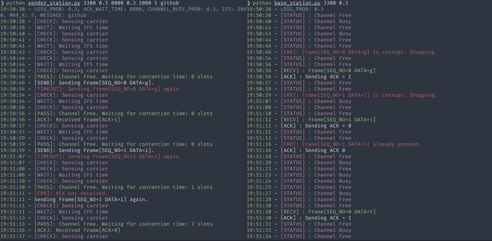

# arq-protocols (and other stuff)

This repository contains implementation of 3 protocols:

- Stop and Wait ARQ
- Go Back N ARQ
- Selective Repeat ARQ

And also some bonus stuff including:

- CSMA/CA Simulation

### How to run

1. Clone this repository
2. *(optional)* Create a virtual environment before running.
   1. Install some additional python packages: ```pip install coloredlogs verboselogs```
   2. If you want to use the logging module only, you can modify the code under ```# Configure Logging``` for every file.
3. Run sender and receiver in seperate tabs/windows.
4. The command line arguments are as follows:<br></br>
   1. **Stop and Wait ARQ**<br>Sender: ```python sw_sender.py <PORT> <LOSS_PROB> <ACK_TIMEOUT> <MESSAGE>```</br>Receiver: ```python sw_receiver.py <PORT> <LOSS_PROB>```</br><br>
   2. **Go Back N ARQ**<br>Sender: ```python gbn_sender.py <PORT> <SEQ_NO_BIT_WIDTH> <LOSS_PROB> <ACK_TIMEOUT> <MESSAGE>```</br>Receiver: ```python gbn_receiver.py <PORT> <SEQ_NO_BIT_WIDTH> <LOSS_PROB>```</br><br>
   3. **Selective Repeat ARQ**<br>Sender: ```python sr_sender.py <PORT> <SEQ_NO_BIT_WIDTH> <LOSS_PROB>  <ACK_TIMEOUT> <MESSAGE>```</br>Receiver: ```python sr_receiver.py <PORT> <SEQ_NO_BIT_WIDTH> <LOSS_PROB>```</br><br>
   4. **CSMA/CA Simulation**<br>CSMA/CA has been implemented on top of Stop and Wait ARQ<br>Sender station: ```python sender_station.py <PORT> <LOSS_PROB>  <ACK_TIMEOUT> <CHANNEL_BUSY_PROB> <IFS> <MAX_K> <MESSAGE>```</br>Base Station: ```python base_station.py <PORT> <LOSS_PROB>```</br>

### Additional Notes

- Make sure ```PORT``` and ```SEQ_NO_BIT_WIDTH``` is same for both sender and receiver
- ```ACK_TIMEOUT``` is in milliseconds.
- The window length for Go Back N and Selective Repeat ARQ is calculated as ```(2 ** SEQ_NO_BIT_WIDTH) - 1``` and ```2 ** (SEQ_NO_BIT_WIDTH - 1)``` respectively
- For CSMA/CA,  ```IFS``` is in milliseconds.

### Additional Notes (Ubuntu)

- Added single script to run all files. Use ```./arq.sh -h``` for help.
- If you use zsh, change ```-- bash``` to ```-- zsh``` in lines 71, 74, 77. If you use any other terminal, make appropriate changes

### Examples

Stop and Wait ARQ


Go Back N ARQ


Selective Repeat ARQ


CSMA/CA Simulation


*UEC1604 - Communication Networks, SSN College of Engineering*