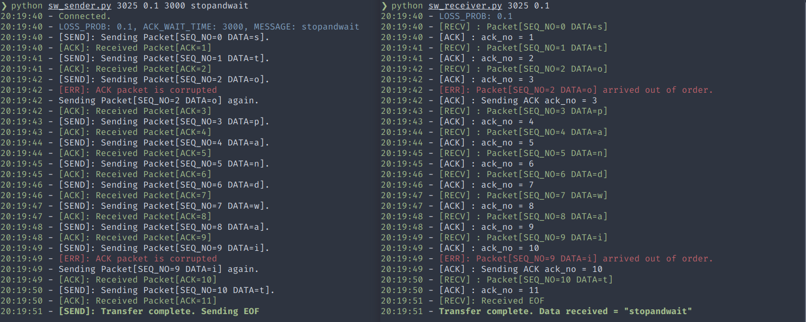
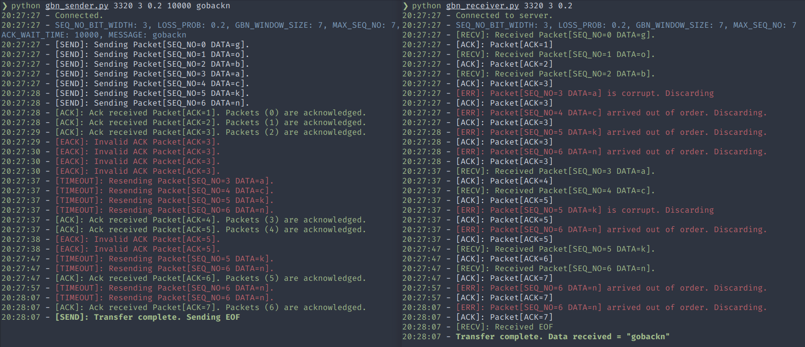
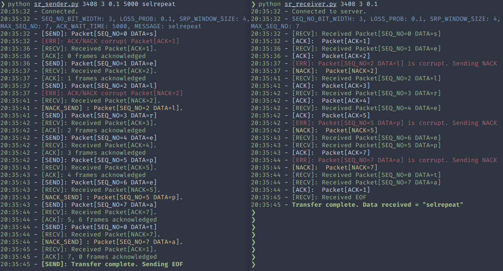

# arq-protocols

This repository contains implementation of 3 protocols:

- Stop and Wait ARQ
- Go Back N ARQ
- Selective Repeat ARQ

### How to run

1. Clone this repository
2. *(optional)* Create a virtual environment before running.
   1. Install some additional python packages: ```pip3 install coloredlogs verboselogs```
   2. If you want to use the logging module only, you can modify the code under ```# Configure Logging``` for every file.
3. Run sender and receiver in seperate tabs/windows.
4. The command line arguments are as follows:
   1. **Stop and Wait ARQ**<br>Sender: ```python3 sw_sender.py <PORT> <LOSS_PROB> <ACK_TIMEOUT> <MESSAGE>```</br>Receiver: ```python3 sw_receiver.py <PORT> <LOSS_PROB>```</br>
   2. **Go Back N ARQ**<br>Sender: ```python3 gbn_sender.py <PORT> <SEQ_NO_BIT_WIDTH> <LOSS_PROB> <ACK_TIMEOUT> <MESSAGE>```</br>Receiver: ```python3 gbn_receiver.py <PORT> <SEQ_NO_BIT_WIDTH> <LOSS_PROB>```</br>
   3. **Selective Repeat ARQ**<br>Sender: ```python3 sr_sender.py <PORT> <SEQ_NO_BIT_WIDTH> <LOSS_PROB>  <ACK_TIMEOUT> <MESSAGE>```</br>Receiver: ```python3 sr_receiver.py <PORT> <SEQ_NO_BIT_WIDTH> <LOSS_PROB>```</br>

### Additional Notes

- Make sure ```PORT``` and ```SEQ_NO_BIT_WIDTH``` is same for both sender and receiver
- ```ACK_TIMEOUT``` is in milliseconds.
- The window length for Go Back N and Selective Repeat ARQ is calculated as ```(2 ** SEQ_NO_BIT_WIDTH) - 1``` and ```2 ** (SEQ_NO_BIT_WIDTH - 1)``` respectively

### Additional Notes (Ubuntu)

- Added single script to run all files. Use ```./arq.sh -h``` for help.
- If you use bash (default), change ```-- zsh``` to ```-- bash``` in lines 71, 74, 77. If you use any other terminal, make appropriate changes

### Examples

Stop and Wait ARQ


Go Back N ARQ


Selective Repeat ARQ


*UEC1604 - Communication Networks, SSN College of Engineering*

© 2021 [Dababy](https://images.genius.com/be8f69860cbafafe944c022b0e2e354c.1000x1000x1.png)